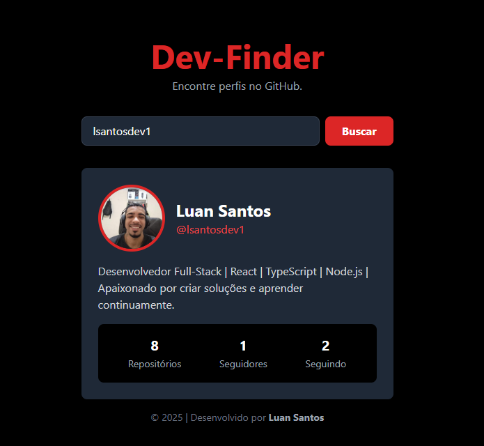

# Dev-Finder 🔍

<div align="center">
  
  
  
  
</div>

<br>

## 🚀 Demo ao Vivo

**[Clique aqui para ver o projeto no ar!](https://dev-finder-rosy.vercel.app/)**

<br>

## 📸 Screenshot


_**Observação:** 

<br>

## 📄 Sobre o Projeto

O **Dev-Finder** é uma aplicação web interativa que permite aos usuários buscar perfis de desenvolvedores no GitHub e visualizar suas informações de forma rápida e organizada. O projeto foi construído para demonstrar o consumo de uma API REST externa, o gerenciamento de estado em React e a criação de uma interface de usuário moderna e responsiva com Tailwind CSS.

<br>

## ✨ Funcionalidades

-   **Busca de Perfis:** Campo de busca para encontrar qualquer usuário existente no GitHub.
-   **Exibição Dinâmica de Dados:** Apresentação clara das informações do usuário, incluindo avatar, nome, bio, número de repositórios, seguidores e pessoas que segue.
-   **Link Direto:** Acesso rápido ao perfil completo do usuário no site do GitHub.
-   **Tratamento de Estado:** Feedback visual para estados de carregamento (loading) e erro (usuário não encontrado).
-   **Design Responsivo:** A interface se adapta perfeitamente a dispositivos móveis, tablets e desktops.

<br>

## 🛠️ Tecnologias Utilizadas

-   **React:** Biblioteca para a construção da interface de usuário.
-   **TypeScript:** Para adicionar tipagem estática ao JavaScript, garantindo um código mais robusto.
-   **Vite:** Ferramenta de build moderna e ultrarrápida para o frontend.
-   **Tailwind CSS:** Framework CSS utility-first para estilização rápida e customizável.
-   **GitHub API:** API REST pública utilizada para buscar os dados dos perfis.

<br>

## ⚙️ Como Rodar o Projeto Localmente

Para rodar este projeto em sua máquina, siga os passos abaixo:

1.  **Clone o repositório:**
    ```bash
    git clone [https://github.com/luanjob/dev-finder.git](https://github.com/luanjob/dev-finder.git)
    ```
2.  **Navegue para a pasta do projeto:**
    ```bash
    cd dev-finder
    ```
3.  **Instale as dependências:**
    ```bash
    npm install
    ```
4.  **Inicie o servidor de desenvolvimento:**
    ```bash
    npm run dev
    ```
5.  Abra `http://localhost:5173` (ou a porta que aparecer no terminal) no seu navegador.

<br>

## 👨‍💻 Autor

Feito  por **Luan Santos**.

-   GitHub: [@lsantosdev1](https://www.linkedin.com/in/1luansantosdev/)
-   LinkedIn: [luansantosdev](https://www.linkedin.com/in/1luansantosdev/)